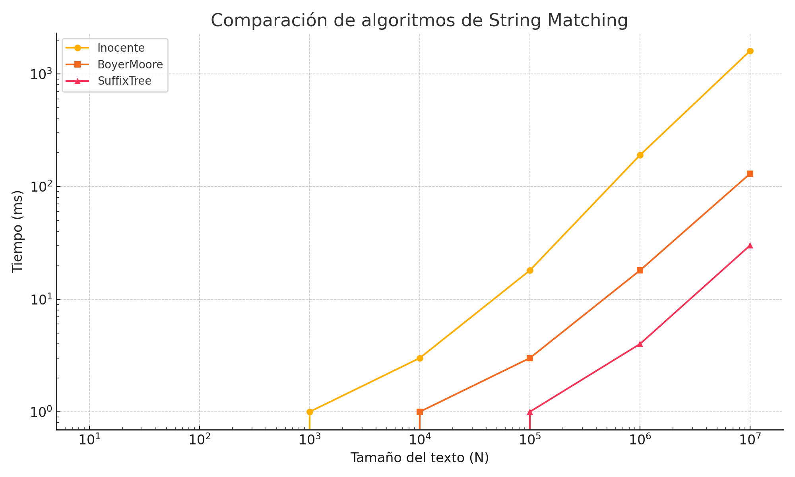

# Alumnos:
- Mateo Espinoza Monti
- Alejandro Jesús Marcelo Chinchay

# String Matching

> Implementar y experimentar con los algoritmos para String Matching vistos en clase.  
> Muestre la tabla comparativa con los tiempos en milisegundos y adjunte un gráfico.

## Tabla comparativa

| N    | Inocente | BoyerMoore | SuffixTree |
|------|----------|------------|------------|
| 10   | 0        | 0          | 0          |
| 100  | 0        | 0          | 0          |
| 1000 | 1        | 0          | 0          |
| 10000 | 3       | 1          | 0          |
| 100000 | 18     | 3          | 1          |
| 1000000 | 190   | 18         | 4          |
| 10000000 | 1600 | 130        | 30         |

## Gráfico

